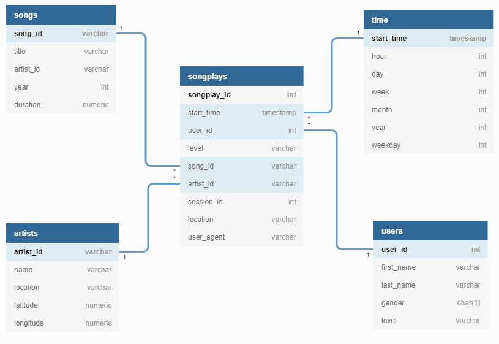

# Data Modeling with Postgres

FWD Data Engineering Nanodegree from Udacity project I.

## Overview

A startup called Sparkify wants to analyze the data they've been collecting on songs and user activity on their new music streaming app. 

create a database schema , Postgres database with tables designed to optimize queries on song play analysis and ETL pipeline for this analysis.

## Description
I will define fact and dimension tables for a star schema for a particular analytic focus, and write an ETL pipeline that transfers data from files in two local directories into these tables in Postgres using Python and SQL.

## Schema

## Dataset
* **Song Dataset:**
  - The first dataset is a subset of real data from the [Million Song Dataset](http://millionsongdataset.com/). 
   Each file is in JSON format and contains metadata about a song and the 
   artist of that song. The files are partitioned by the first three letters of 
   each song's track ID. For example, here are file paths to two files in this 
   dataset.
`song_data/A/B/C/TRABCEI128F424C983.json
song_data/A/A/B/TRAABJL12903CDCF1A.json`
  - And below is an example of what a single song file, TRAABJL12903CDCF1A.json, looks like.
`{"num_songs": 1, "artist_id": "ARJIE2Y1187B994AB7", "artist_latitude": null, "artist_longitude": null, "artist_location": "", "artist_name": "Line Renaud", "song_id": "SOUPIRU12A6D4FA1E1", "title": "Der Kleine Dompfaff", "duration": 152.92036, "year": 0}`
* **Log Dataset:**
  - The second dataset consists of log files in JSON format generated by this event simulator based on the songs in the dataset above. These simulate activity logs from a music streaming app based on specified configurations.
  - The log files in the dataset you'll be working with are partitioned by year and month. For example, here are filepaths to two files in this dataset.
`log_data/2018/11/2018-11-12-events.json
log_data/2018/11/2018-11-13-events.json`

## Prerequisites

* Python 3
* `panda` and `psycopg2`
* A PosgreSQL database

## Tables
Using the song and log datasets, you'll need to create a star schema optimized for queries on song play analysis. This includes the following tables: 

**Fact Table**

- **songplays** : records in log data associated with song plays

**4 Dimension Tables**

1. **users** : users in the app
2. **songs** : songs in music database
3. **artists** : artists in music database
4. **time** : timestamps of records in songplays broken down into specific units

## Files
1. `test.ipynb` displays the first few rows of each table to let you check your database.
2. `create_tables.py` drops and creates your tables. You run this file to reset your tables before each time you run your ETL scripts.
3. `etl.ipynb` reads and processes a single file from song_data and log_data and loads the data into your tables. This notebook contains detailed instructions on the ETL process for each of the tables.
4. `etl.py` reads and processes files from song_data and log_data and loads them into your tables.
5. `sql_queries.py` contains all your sql queries, and is imported into the last three files above.

**NOTE**: You will not be able to run `test.ipynb`, `etl.ipynb`, or `etl.py` until you have run `create_tables.py` at least once to create the sparkifydb database, which these other files connect to.